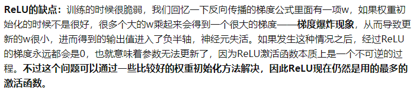
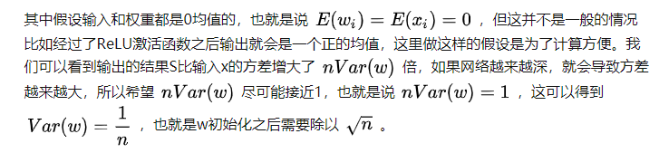

# 一、代码实现中的错误

## sigmoid + MSE版本

参考博客： https://blog.csdn.net/xholes/article/details/78461164

1. 实现MSE版本的时候，最后一层求导错误。因为最后一层使用softmax函数，$z{i}$ 会对所有的$a$ 产生影响，所以$ \frac{\partial a}{\partial z} $求导时出现错误。
2. 批处理样本的时候，整批的损失是单个样本损失之和，所以每个样本的$\frac{\partial L}{\partial b} 、\frac{\partial L}{\partial W}$ 应该累加起来。

## sigmoid + CELF版本

1. 注意交叉熵函数的定义。


​		这个定义中的$ x $ 指的是输出层未经过softmax之前的张量。

​		

​		这个式子中的$ \hat{y} $ 是指经过softmax之后的张量

2. 注意softmax函数的定义

   exp(x)之和不是所有的exp(x)之和，是单个样本的exp(x)之和。批处理的时候下面的代码时错误的。

   ```python
   def soft(self, x):
   	fenmu = torch.exp(x).sum()
   	fenzi = torch.exp(x)
   	return fenzi / fenmu
   ```

3. 准确率达到 94.6%

## ReLU + CELF版本

1. 参考博客 https://blog.csdn.net/qq_37667364/article/details/88790340

2. ReLU函数及其导数的自定义如下：

```python
def ReLU(self, x):
	y = (torch.clamp(x, min=0)).float()
    return y

def d_ReLU(self, x):
	y = (x > 0).float()
    return y
```

3. 使用ReLU函数作为激活函数时出现**梯度爆炸**，初始化权重的时候需要除 $ \sqrt{n} $

```python
def init_parameters(self): 
    self.W.append(
        torch.randn(self.hidden1_size, self.input_size) /
        math.sqrt(28 * 28))
    self.W.append(
        torch.randn(self.hidden2_size, self.hidden1_size) /
        math.sqrt(28 * 28))
    self.W.append(
        torch.randn(self.hidden3_size, self.hidden2_size) /
        math.sqrt(28 * 28))
    self.W.append(
        torch.randn(self.output_size, self.hidden3_size) /
        math.sqrt(28 * 28))
    self.b.append(torch.randn(self.hidden1_size, 1) / math.sqrt(28 * 28))
    self.b.append(torch.randn(self.hidden2_size, 1) / math.sqrt(28 * 28))
    self.b.append(torch.randn(self.hidden3_size, 1) / math.sqrt(28 * 28))
    self.b.append(torch.randn(self.output_size, 1) / math.sqrt(28 * 28))
```






4. 准确度达到：97.9%

```python
# 19 100 i
# loss : 0.00001 train : 1.000 test :  0.979
# 19 200 i
# loss : 0.00048 train : 1.000 test :  0.978
# 19 300 i
# loss : 0.00057 train : 1.000 test :  0.978
# 19 400 i
# loss : 0.00027 train : 1.000 test :  0.978
# 19 500 i
# loss : 0.00088 train : 1.000 test :  0.980
# 19 600 i
# loss : 0.00059 train : 1.000 test :  0.980
# 19 700 i
# loss : 0.00025 train : 1.000 test :  0.980
# 19 800 i
# loss : 0.00142 train : 1.000 test :  0.979
# 19 900 i
# loss : 0.00066 train : 1.000 test :  0.980
# 19 1000 i
# loss : 0.00038 train : 1.000 test :  0.979
# 19 1100 i
# loss : 0.00171 train : 1.000 test :  0.980
# 19 1200 i
# loss : 0.00740 train : 1.000 test :  0.981
# 19 1300 i
# loss : 0.00247 train : 1.000 test :  0.979
# 19 1400 i
# loss : 0.00008 train : 1.000 test :  0.979
# 19 1500 i
# loss : 0.00043 train : 1.000 test :  0.978
# 19 1600 i
# loss : 0.00130 train : 1.000 test :  0.980
# 19 1700 i
# loss : 0.00159 train : 1.000 test :  0.980
# 19 1800 i
# loss : 0.00290 train : 1.000 test :  0.979
```

