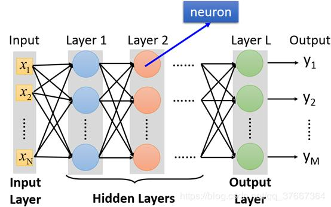
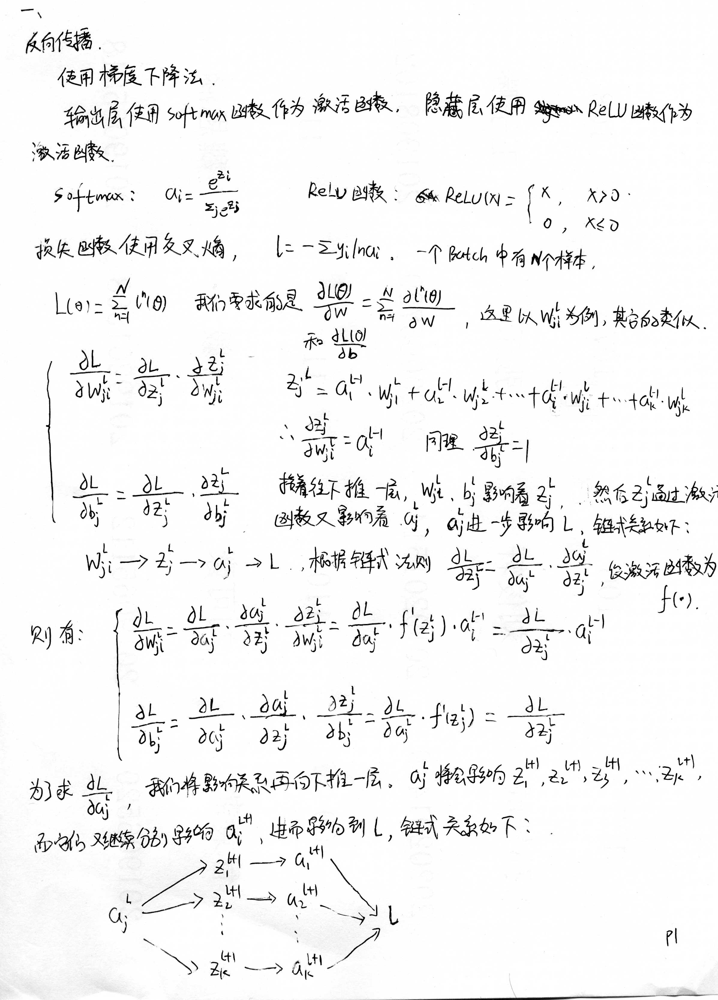
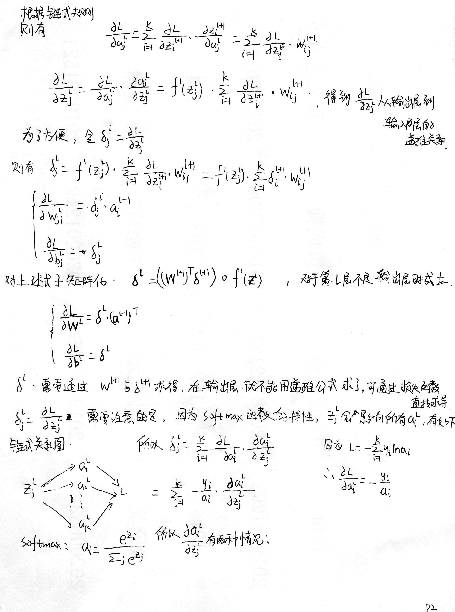
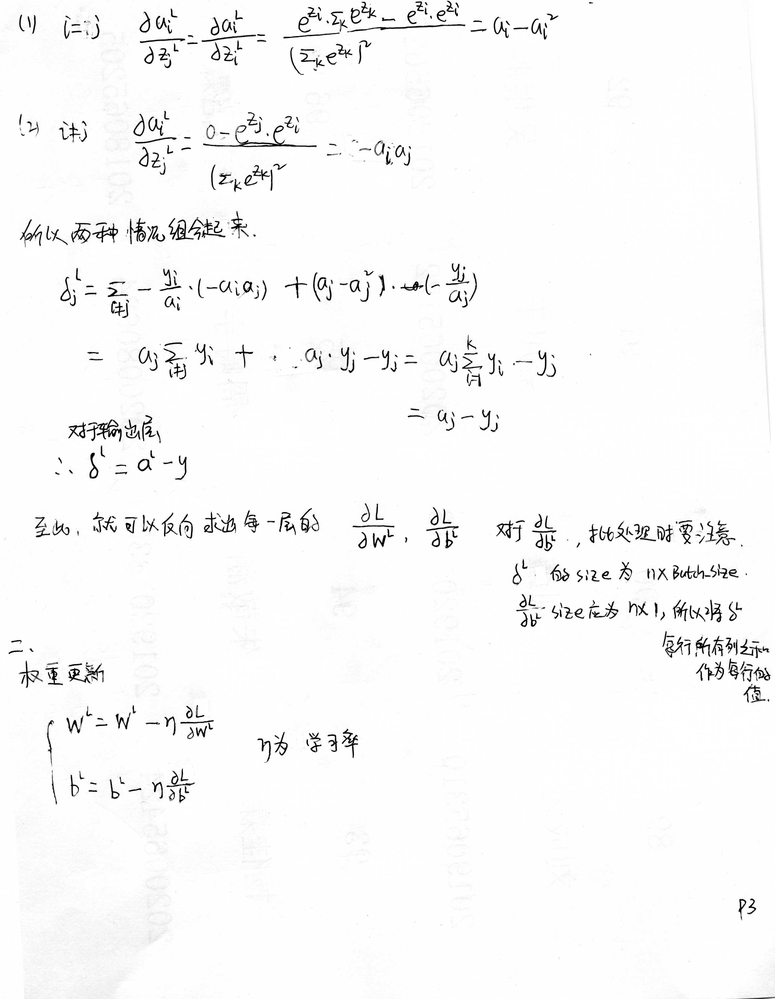

使用pytorch框架实现MLP。为了深入了解源码，没有使用pytorch中torch.nn.Module类和其它现有的方法，大部分功能手写实现。

data文件夹中是数据集。

ReLU_CELF.py 是代码，激活函数使用ReLU，损失函数使用交叉熵。

”MLP文档“文件夹中有实现过程与编写代码时遇到的错误，实现过程中的内容与下文一致，实现过程中包括手写。


# 多层感知机：Multi-Layer Perceptron 

## 多层感知机构建步骤：

1. 构建网络模型
2. 权重初始化
3. 前向传播
4. 计算损失
5. 反向传播求梯度
6. 更新权重

# 1. 构建网络模型

多层神经网络中第一层称之为输入层，最后一层称之为输出层，中间的层称之为隐层。在分类模型中，输出层的每一个变量对应一个类别。层与层之间两两单元之间存在连接。

在本模型中输入是一个$28\times28$的图片，所以输入层大小是784，中间两个隐层大小分别是512，128。因为该模型用于识别MNIST手写集，相当于十分类，输出层大小为10。

# 2. 权重初始化

使用python中的randn来进行权重初始化。

$torch.randn$ 返回一个包含了从标准正态分布中抽取的一组随机数的张量。

```python
def init_parameters(self):
    self.W.append(torch.randn(self.hidden1_size, self.input_size))
    self.W.append(torch.randn(self.hidden2_size, self.hidden1_size))
    self.W.append(torch.randn(self.output_size, self.hidden2_size))
    self.b.append(torch.randn(self.hidden1_size, 1))
    self.b.append(torch.randn(self.hidden2_size, 1))
    self.b.append(torch.randn(self.output_size, 1))
```

在使用ReLU函数时，权值初始化出现问题。如果输入的x比较大，初始化权值w也比较大，那么就会导致计算出的a比较大，会出现很大的负数或者正数。导致最终计算经过softmax函数后的输出层时，会出现很多值为0，一个值为1的情况，这样对计算loss值是非常不利的，因为会计算$log(0)$。

同时，如果w值比较大的话，还可能会出现梯度爆炸的问题。

最后使用 小随机数或者除$\sqrt{n}$ 的方法来解决，将权重初始化为比较小的值。

```python
def init_parameters(self):
        self.W.append(
            0.01 * torch.randn(self.hidden1_size, self.input_size))
        self.W.append(
            0.01 * torch.randn(self.hidden2_size, self.hidden1_size))
        self.W.append(
            0.01 * torch.randn(self.hidden3_size, self.hidden2_size))
        self.W.append(
            0.01 * torch.randn(self.output_size, self.hidden3_size))
        self.b.append(0.01 * torch.randn(self.hidden1_size, 1))
        self.b.append(0.01 * torch.randn(self.hidden2_size, 1))
        self.b.append(0.01 * torch.randn(self.hidden3_size, 1))
        self.b.append(0.01 * torch.randn(self.output_size, 1))
```

# 3. 前向传播



设变量的上标代表所处的神经网络的第几层。

$W^{l}$连接第$l$层到第$l-1$层的权重矩阵中，其中$W_{ji}^{l}$表示第$l-1$层的第$i$个节点与第$l$层的第$j$个节点的权重。

$z_{j}^{l+1} = \sum_{i=1}^{n}w_{ji}^{l+1}a_{i}^{l}=w_{j1}^{l+1}a_{1}^{l}+w_{j2}^{l+1}a_{2}^{l}+w_{j3}^{l+1}a_{3}^{l}+...+w_{jn}^{l+1}a_{n}^{l}$ 

$a_{j}^{l} = f(z_{j}^{l})$，其中$f(\cdot)$为激活函数。

将上述式子转化成矩阵表达式
$$
\begin{cases}
{\bf Z}^{l}={\bf W}^{l}{\bf a}^{l-1}+{\bf b}^{l}\\
{\bf {a}}^{l}=f({\bf z^{l}})\\
\end{cases}
$$

# 4. 计算损失

使用交叉熵作为损失函数

设我们预测的结果是$\hat{Y}$是我们预测的结果，$Y$是真实分类情况的one-hat编码。

则 $L = -\sum\limits_{i=1}^{n}y_{i}log\hat{y}_{i}$

注意这里的$\hat{Y}$应该是经过softmax函数处理之后的输出，这样能保证 $\sum\limits_{i=1}^{n}=1$

# 5. 反向传播与更新参数







# 训练过程可视化

使用pytorch内置的Tensorboard进行绘图


训练过程展示，每100个batch绘制一个点

<div style="width:45%; display: inline-block">
        
    <br>
    <center>
        <div style="color:orange; border-bottom:1px solid #d9d9d9; display: inline-block; color: #999;    padding: 2px;">
        	Train_Loss
    	</div> 
    </center>
</div>   
<div style="width:45%; display: inline-block">
        
    <br>
    <center>
        <div style="color:orange; border-bottom:1px solid #d9d9d9; display: inline-block; color: #999;    padding: 2px;">
        	Train_Accuracy
    	</div> 
    </center>
</div> 


测试过程展示，每100个batch绘制一个点

<div style="width:45%; display: inline-block">
        
    <br>
    <center>
        <div style="color:orange; border-bottom:1px solid #d9d9d9; display: inline-block; color: #999;    padding: 2px;">
            Test_Loss
        </div> 
    </center>
</div>
<div style="width:45%; display: inline-block">
        
    <br>
    <center>
        <div style="color:orange; border-bottom:1px solid #d9d9d9; display: inline-block; color: #999;    padding: 2px;">
        	Test_Accuracy
    	</div> 
    </center>
</div> 


​    


